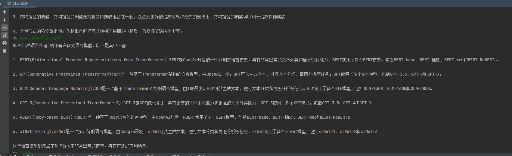

# LLM（Large Language Model）


一些大语言模型的使用示例。

## ChatGLM
ChatGLM-6B 是一个开源的、支持中英双语问答的对话语言模型，基于 General Language Model (GLM) 架构，具有 62 亿参数。结合模型量化技术，用户可以在消费级的显卡上进行本地部署（INT4 量化级别下最低只需 6GB 显存）。ChatGLM-6B 使用了和 ChatGLM 相同的技术，针对中文问答和对话进行了优化。经过约 1T 标识符的中英双语训练，辅以监督微调、反馈自助、人类反馈强化学习等技术的加持，62 亿参数的 ChatGLM-6B 已经能生成相当符合人类偏好的回答。
[[GitHub](https://github.com/THUDM/ChatGLM-6B)]
- 依赖环境
    ```  
  transformers==4.27.1
  torch==1.10.1
  protobuf==3.20.0
  cpm_kernels==1.0.11
  sentencepiece==0.1.99
  pandas==1.5.2
    ```
- 使用
  ```
  >> python ChatGLM.py
  ```
  

- 模型量化
  > 默认情况下，模型以 FP16 精度加载，运行上述代码需要大概 13GB 显存。如果你的 GPU 显存有限，可以尝试以量化方式加载模型，使用方法如下：
  ```python
  # 按需修改，目前只支持 4/8 bit 量化
  model = AutoModel.from_pretrained("chatglm-6b", trust_remote_code=True).quantize(8).half().cuda()
  ```
  > 进行 2 至 3 轮对话后，8-bit 量化下 GPU 显存占用约为 10GB，4-bit 量化下仅需 6GB 占用。随着对话轮数的增多，对应消耗显存也随之增长，由于采用了相对位置编码，理论上 ChatGLM-6B 支持无限长的 context-length，但总长度超过 2048（训练长度）后性能会逐渐下降。
  

详细使用说明：[THUDM/ChatGLM-6B](https://github.com/THUDM/ChatGLM-6B)

### 模型微调
测试了”垃圾评论分类“任务，数据集位于：`./chatglm-6b/fine_tune/SpamClassify`
- 依赖环境(额外)
  ```  
  datasets==2.13.0
  rouge_chinese==1.0.3
  nltk==3.8.1
  jieba==0.42.1
  cchardet==2.1.7
  ```
- 微调指令
  ```bash
  >> cd chatglm-6b/fine_tune/
  >> python chatglm_ptuning.py  --do_train --train_file SpamClassify/train.json  --validation_file SpamClassify/dev.json --prompt_column  content --response_column label --overwrite_cache --model_name_or_path ..\\..\\chatglm-6b --output_dir output/spamclassify-chatglm-6b-pt-4-2e-2 --overwrite_output_dir --max_source_length 64 --max_target_length 64 --per_device_train_batch_size 1 --per_device_eval_batch_size 1 --gradient_accumulation_steps 16 --predict_with_generate --max_steps 300 --logging_steps 10 --save_steps 100 --learning_rate 2e-2 --pre_seq_len 128
  ```
  微调参数参考这里：[ChatGLM-6B-ptuning](https://github.com/THUDM/ChatGLM-6B/blob/main/ptuning/README.md)

- 使用
  ```bash
  >> python ChatGLM_finetuning.py
  ```

