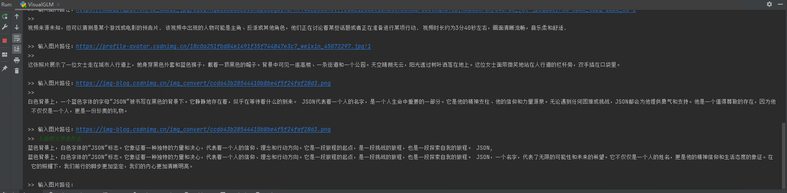
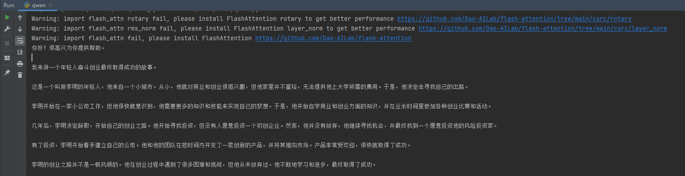

# LLMs（Large Language Models）


一些大语言模型的使用示例。

## 1、ChatGLM
ChatGLM-6B 是一个开源的、支持中英双语问答的对话语言模型，基于 General Language Model (GLM) 架构，具有 62 亿参数。结合模型量化技术，用户可以在消费级的显卡上进行本地部署（INT4 量化级别下最低只需 6GB 显存）。ChatGLM-6B 使用了和 ChatGLM 相同的技术，针对中文问答和对话进行了优化。经过约 1T 标识符的中英双语训练，辅以监督微调、反馈自助、人类反馈强化学习等技术的加持，62 亿参数的 ChatGLM-6B 已经能生成相当符合人类偏好的回答。
[[GitHub](https://github.com/THUDM/ChatGLM-6B)]
- 依赖环境
    ```  
  transformers==4.27.1
  torch==1.13.1
  protobuf==3.20.0
  cpm_kernels==1.0.11
  sentencepiece==0.1.99
  pandas==1.5.2
    ```
- 使用
  ```
  >> python chatglm.py
  ```
  

- 模型量化
  > 默认情况下，模型以 FP16 精度加载，运行上述代码需要大概 13GB 显存。如果你的 GPU 显存有限，可以尝试以量化方式加载模型，使用方法如下：
  ```python
  # 按需修改，目前只支持 4/8 bit 量化
  model = AutoModel.from_pretrained("chatglm-6b", trust_remote_code=True).quantize(8).half().cuda()
  ```
  > 进行 2 至 3 轮对话后，8-bit 量化下 GPU 显存占用约为 10GB，4-bit 量化下仅需 6GB 占用。随着对话轮数的增多，对应消耗显存也随之增长，由于采用了相对位置编码，理论上 ChatGLM-6B 支持无限长的 context-length，但总长度超过 2048（训练长度）后性能会逐渐下降。
  

详细使用说明：[THUDM/ChatGLM-6B](https://github.com/THUDM/ChatGLM-6B)

### 模型微调
测试了”垃圾评论分类“任务，数据集位于：`./chatglm-6b/fine_tune/SpamClassify`
- 依赖环境(额外)
  ```  
  datasets==2.13.0
  rouge_chinese==1.0.3
  nltk==3.8.1
  jieba==0.42.1
  cchardet==2.1.7
  ```
- 微调指令
  ```bash
  >> cd chatglm-6b/fine_tune/
  >> python chatglm_ptuning.py  --do_train --train_file SpamClassify/train.json  --validation_file SpamClassify/dev.json --prompt_column  content --response_column label --overwrite_cache --model_name_or_path ..\\..\\chatglm-6b --output_dir output/spamclassify-chatglm-6b-pt-4-2e-2 --overwrite_output_dir --max_source_length 64 --max_target_length 64 --per_device_train_batch_size 1 --per_device_eval_batch_size 1 --gradient_accumulation_steps 16 --predict_with_generate --max_steps 300 --logging_steps 10 --save_steps 100 --learning_rate 2e-2 --pre_seq_len 128
  ```
  微调参数参考这里：[ChatGLM-6B-ptuning](https://github.com/THUDM/ChatGLM-6B/blob/main/ptuning/README.md)

- 使用
  ```bash
  >> python chatglm_finetuning.py
  ```


## 2、ChatGLM2
ChatGLM2-6B 是开源中英双语对话模型 ChatGLM-6B 的第二代版本，在保留了初代模型对话流畅、部署门槛较低等众多优秀特性的基础之上，ChatGLM2-6B 引入了如下新特性：

- **更强大的性能**：基于 ChatGLM 初代模型的开发经验，我们全面升级了 ChatGLM2-6B 的基座模型。ChatGLM2-6B 使用了 GLM 的混合目标函数，经过了 1.4T 中英标识符的预训练与人类偏好对齐训练，评测结果显示，相比于初代模型，ChatGLM2-6B 在 MMLU（+23%）、CEval（+33%）、GSM8K（+571%） 、BBH（+60%）等数据集上的性能取得了大幅度的提升，在同尺寸开源模型中具有较强的竞争力。
- **更长的上下文**：基于 FlashAttention 技术，我们将基座模型的上下文长度（Context Length）由 ChatGLM-6B 的 2K 扩展到了 32K，并在对话阶段使用 8K 的上下文长度训练，允许更多轮次的对话。但当前版本的 ChatGLM2-6B 对单轮超长文档的理解能力有限，我们会在后续迭代升级中着重进行优化。
- **更高效的推理**：基于 Multi-Query Attention 技术，ChatGLM2-6B 有更高效的推理速度和更低的显存占用：在官方的模型实现下，推理速度相比初代提升了 42%，INT4 量化下，6G 显存支持的对话长度由 1K 提升到了 8K。
- **更开放的协议**：ChatGLM2-6B 权重对学术研究完全开放，在获得官方的书面许可后，亦允许商业使用。如果您发现我们的开源模型对您的业务有用，我们欢迎您对下一代模型 ChatGLM3 研发的捐赠。
[[GitHub](https://github.com/THUDM/ChatGLM2-6B)]


  
**（使用方式同ChatGLM ↑↑↑）**

## 3、VisualGLM
VisualGLM-6B 是一个开源的，支持图像、中文和英文的多模态对话语言模型，语言模型基于 ChatGLM-6B，具有 62 亿参数；图像部分通过训练 BLIP2-Qformer 构建起视觉模型与语言模型的桥梁，整体模型共78亿参数。
[[GitHub](https://github.com/THUDM/VisualGLM-6B)]
- 依赖环境
    ```  
  transformers==4.27.1
  torch==1.13.1
  protobuf==3.20.0
  cpm_kernels==1.0.11
  sentencepiece==0.1.99
  pandas==1.5.2
  
  datasets==2.13.0
  einops==0.6.1
  SwissArmyTransformer==0.3.7
    ```
  注：sat库安装时的名称是“SwissArmyTransformer”。

  Windows上安装可能会报错，可以使用以下指令安装：`pip install --no-deps "SwissArmyTransformer>=0.3.6" -i https://pypi.tuna.tsinghua.edu.cn/simple`

  <br/>

- 使用
  ```
  >> python visualglm.py
  ```
  

详细使用说明：[THUDM/VisualGLM-6B](https://github.com/THUDM/VisualGLM-6B)


## 4、Qwen
通义千问-7B（Qwen-7B）是阿里云研发的通义千问大模型系列的70亿参数规模的模型。Qwen-7B是基于Transformer的大语言模型, 在超大规模的预训练数据上进行训练得到。预训练数据类型多样，覆盖广泛，包括大量网络文本、专业书籍、代码等。同时，在Qwen-7B的基础上，使用对齐机制打造了基于大语言模型的AI助手Qwen-7B-Chat。
[[GitHub](https://github.com/QwenLM/Qwen-7B)]
- 依赖环境
    ```  
  transformers==4.31.0
  torch==1.13.1
  einops=0.6.1
  
  tiktoken==0.4.0
  accelerate==0.21.0
  # flash_attn==1.0.8
    ```  

    注：flash_attn库安装时可能会报错（可不装）：

     1、`error: Microsoft Visual C++ 14.0 or greater is required. Get it with "Microsoft C++ Build Tools": https://visualstudio.microsoft.com/visual-cpp-build-tools/`
        
   需要安装c++环境。 可参考：https://blog.csdn.net/bluishglc/article/details/128889935

   2、之后使用以下指令安装：`pip install -i https://pypi.tuna.tsinghua.edu.cn/simple flash_attn==1.0.8  --no-build-isolation`


- 使用
  ```
  >> python qwen.py
  ```
  
  

详细使用说明：[QwenLM/Qwen-7B](https://github.com/QwenLM/Qwen-7B)
